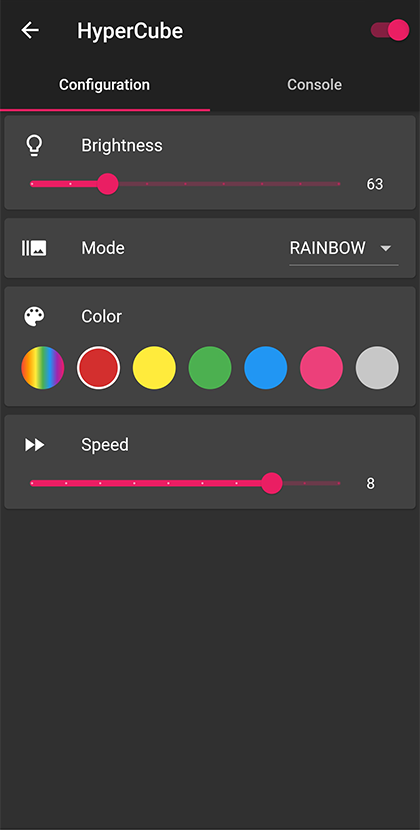

# HyperCube

Homemade clone of the [HyperCube by the Hyperspace Lighting Company](https://www.hyperspacelight.com/the-hypercube).

[Photos on my website](https://galerie.strangeplanet.fr/index.php?/category/199)

## Parts list

### 3D printed parts

- 6x beam
- 2x beam-w-hole
- 2x beam-bottom (one symmetry !)
- 2x beam-bottom-w-hole (one symmetry !)
- 4x corner
- 4x corner-bottom
- 5x corner-cache
- 1x corner-cache-w-hole
- 4x panel-holder

In doubt you can replace all beam variants by :
- 8x beam-w-hole
- 4x beam-bottom-w-hole (two symmetries !)

The no-hole variants use less material and are faster to print.

#### External electronics case

- 1x electronics-case
- 1x electronics-case-top
- 1x support

#### Electronics case inside support

- 1x electronics-case-support
- 1x button

### Hardware

- 6x 210mm/2mm square one-way mirrors (or standard glass/PMAA with one-way film)
- 24x M2 15mm wood screws

### Electronics

- 6x 80cm WS2812 LED strips (60 LEDS/m)
- 1x 10A 5V power supply
- 3-wire cable

#### External electronics case

- 1x Arduino Nano
- 1x Bluetooth module
- 1x capacitive touch button (20x15mm)

#### Electronics case inside support

- 1x Wemos D1 mini
- 1x mini push button (5.8x5.8mm)

## Assembly

1. Start building the cube from the top panel, taking care where you use beams with or without holes to pass the wires. You will use all beams and corner pieces and five panels, dont put the last bottom panel yet
2. Cut the LED strips to lenght en solder the wires, I recommend using dedicated power lines for each strip but you can use a single wire for the data line
3. Glue the strips to each side and pass the wires in the beams, all wires must output on the same corner. I recommend adding CA glue as the standard 3M tape is not adhesive enough
4. Check that every strip is working correctly
5. Put the bottom panel and secure it in place by glueing the four panel holders
6. Glue all height corner caches

The following diagram shows one way to arrange strips (flattened cube seen from top).  

## Code

### Configuration

Edit the `constants.h` file according to your wiring :

- `LED_PIN` output pin use to control LEDS
- `BUTTON_PIN` input pin for the control button
- `BLE_RXD` RX pin for the BLE module
- `BLE_TXD` TX pin for the BLE module

Edit `MAX_MILLI_AMPS` according to the rating of your power supply (keep a safety margin, especially with cheap Chinese stuff).

### Controls

The cube is controlled via USB and Bluetooth and can received basic serial commands (`\n` terminated):

- `ON` to turn on the light
- `OFF` to turn off the light
- `BRIGHT X`(X=0-255) to change the brightness
- `BRIGHT+` to increase the brightness by 16
- `BRIGHT-` to decrease the brightness by 16
- `MODE X` to change the current mode, modes are:
	- `RAINBOW`
	- `RAINDROP`
	- `PULSE`
	- `CYLON`
	- `CHASER`
	- `NOISE`
	- `GRADIENT`
	- `RIPPLES`
- `MODE+` to use the next mode
- `MODE-` to use the previous mode
- `COLOR X` to change the current color, hues are:
	- `RAINBOW`
	- `RED`
	- `YELLOW`
	- `GREEN`
	- `BLUE`
	- `PINK`
	- `WHITE`
- `COLOR+` to use the next color
- `COLOR-` to use the previous color
- `SPEED X` (X=1-10) to change the speed
- `SPEED+` to increase the speed by 1
- `SPEED-` to decrease the speed by 1
- `PATTERN [A=X] [Z=X] C=X` use a custom color pattern
	- `A=X` (X=0/F/B): animate the pattern on `F`orward or `B`ackward direction (uses current `SPEED`)
	- `Z=X` (X=1-10): display the full pattern all at once or only a smaller portion
	- `C=X`: definition of up to 16 color stops, three character each, from `000` to `FFF`
	
*Note*: When controlled over Bluetooth, the controller must send a single `#` char and wait for the `OK` response before sending the command.
This is done to pause the FastLED processing and have enough CPU cycles to consume the larger request.

#### Examples of custom color pattern

- `C=f00`: All red
- `A=F C=000FFF`: Animated Black/White gradient
- `C=000FFF000FFF000FFF000FFF000FFF`: Static checker
- `A=B Z=5 C=F0000F`: Animated Red/Blue gradient with zoom applied
- `A=F Z=10 C=5F55F500000055F000`: Pulsating Green/Blue

*Note*: Commands over 20 chars long must be splitted into multiple packets, by limitation of the Serial over Bluetooth protocol.
Only the last packet will be `\n` terminated.

## Application

A flutter application (Android only) allows to control the light from your smartphone. It is only compatible with HM-10 Bluetooth modules.

  

## License

The SolidWorks files, Arduino code and Flutter code are distributed under the Creative Commons 3.0 BY-SA license.
